# Key Objects

[_Documentation generated by Documatic_](https://www.documatic.com)

<!---Documatic-section-toxygen.callbacks.group_message-start--->
## toxygen.callbacks.group_message

<!---Documatic-section-group_message-start--->


### Object Calls

* toxygen.callbacks.invoke_in_main_thread
* toxygen.callbacks.show_gc_notification

<!---Documatic-block-toxygen.callbacks.group_message-start--->
<details>
	<summary><code>toxygen.callbacks.group_message</code> code snippet</summary>

```python
def group_message(window, tray):

    def wrapped(tox, group_number, peer_number, message, length, user_data):
        message = str(message[:length], 'utf-8')
        invoke_in_main_thread(Profile.get_instance().new_gc_message, group_number, peer_number, TOX_MESSAGE_TYPE['NORMAL'], message)
        show_gc_notification(window, tray, message, group_number, peer_number)
    return wrapped
```
</details>
<!---Documatic-block-toxygen.callbacks.group_message-end--->
<!---Documatic-section-group_message-end--->

# #
<!---Documatic-section-toxygen.callbacks.group_message-end--->

<!---Documatic-section-toxygen.util.curr_directory-start--->
## toxygen.util.curr_directory

<!---Documatic-section-curr_directory-start--->
<!---Documatic-block-toxygen.util.curr_directory-start--->
<details>
	<summary><code>toxygen.util.curr_directory</code> code snippet</summary>

```python
@cached
def curr_directory():
    return os.path.dirname(os.path.realpath(__file__))
```
</details>
<!---Documatic-block-toxygen.util.curr_directory-end--->
<!---Documatic-section-curr_directory-end--->

# #
<!---Documatic-section-toxygen.util.curr_directory-end--->

<!---Documatic-section-toxygen.bootstrap.Node-start--->
## toxygen.bootstrap.Node

<!---Documatic-section-Node-start--->
<!---Documatic-block-toxygen.bootstrap.Node-start--->
<details>
	<summary><code>toxygen.bootstrap.Node</code> code snippet</summary>

```python
class Node:

    def __init__(self, node):
        (self._ip, self._port, self._tox_key) = (node['ipv4'], node['port'], node['public_key'])
        self._priority = random.randint(1, 1000000) if node['status_tcp'] and node['status_udp'] else 0

    def get_priority(self):
        return self._priority
    priority = property(get_priority)

    def get_data(self):
        return (bytes(self._ip, 'utf-8'), self._port, self._tox_key)
```
</details>
<!---Documatic-block-toxygen.bootstrap.Node-end--->
<!---Documatic-section-Node-end--->

# #
<!---Documatic-section-toxygen.bootstrap.Node-end--->

<!---Documatic-section-toxygen.tox_dns.tox_dns-start--->
## toxygen.tox_dns.tox_dns

<!---Documatic-section-tox_dns-start--->
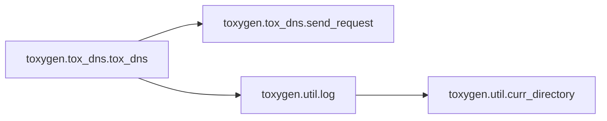

### Object Calls

* toxygen.tox_dns.send_request
* toxygen.util.log

<!---Documatic-block-toxygen.tox_dns.tox_dns-start--->
<details>
	<summary><code>toxygen.tox_dns.tox_dns</code> code snippet</summary>

```python
def tox_dns(email):
    site = email.split('@')[1]
    data = {'action': 3, 'name': '{}'.format(email)}
    urls = ('https://{}/api'.format(site), 'http://{}/api'.format(site))
    s = settings.Settings.get_instance()
    if not s['proxy_type']:
        for url in urls:
            try:
                return send_request(url, data)
            except Exception as ex:
                log('TOX DNS ERROR: ' + str(ex))
    else:
        netman = QtNetwork.QNetworkAccessManager()
        proxy = QtNetwork.QNetworkProxy()
        proxy.setType(QtNetwork.QNetworkProxy.Socks5Proxy if s['proxy_type'] == 2 else QtNetwork.QNetworkProxy.HttpProxy)
        proxy.setHostName(s['proxy_host'])
        proxy.setPort(s['proxy_port'])
        netman.setProxy(proxy)
        for url in urls:
            try:
                request = QtNetwork.QNetworkRequest()
                request.setUrl(QtCore.QUrl(url))
                request.setHeader(QtNetwork.QNetworkRequest.ContentTypeHeader, 'application/json')
                reply = netman.post(request, bytes(json.dumps(data), 'utf-8'))
                while not reply.isFinished():
                    QtCore.QThread.msleep(1)
                    QtCore.QCoreApplication.processEvents()
                data = bytes(reply.readAll().data())
                result = json.loads(str(data, 'utf-8'))
                if not result['c']:
                    return result['tox_id']
            except Exception as ex:
                log('TOX DNS ERROR: ' + str(ex))
    return None
```
</details>
<!---Documatic-block-toxygen.tox_dns.tox_dns-end--->
<!---Documatic-section-tox_dns-end--->

# #
<!---Documatic-section-toxygen.tox_dns.tox_dns-end--->

<!---Documatic-section-toxygen.callbacks.start-start--->
## toxygen.callbacks.start

<!---Documatic-section-start-start--->
<!---Documatic-block-toxygen.callbacks.start-start--->
<details>
	<summary><code>toxygen.callbacks.start</code> code snippet</summary>

```python
def start():
    _thread.start()
```
</details>
<!---Documatic-block-toxygen.callbacks.start-end--->
<!---Documatic-section-start-end--->

# #
<!---Documatic-section-toxygen.callbacks.start-end--->

<!---Documatic-section-toxygen.widgets.create_menu-start--->
## toxygen.widgets.create_menu

<!---Documatic-section-create_menu-start--->
<!---Documatic-block-toxygen.widgets.create_menu-start--->
<details>
	<summary><code>toxygen.widgets.create_menu</code> code snippet</summary>

```python
def create_menu(menu):
    for action in menu.actions():
        text = action.text()
        if 'Link Location' in text:
            text = text.replace('Copy &Link Location', QtWidgets.QApplication.translate('MainWindow', 'Copy link location'))
        elif '&Copy' in text:
            text = text.replace('&Copy', QtWidgets.QApplication.translate('MainWindow', 'Copy'))
        elif 'All' in text:
            text = text.replace('Select All', QtWidgets.QApplication.translate('MainWindow', 'Select all'))
        elif 'Delete' in text:
            text = text.replace('Delete', QtWidgets.QApplication.translate('MainWindow', 'Delete'))
        elif '&Paste' in text:
            text = text.replace('&Paste', QtWidgets.QApplication.translate('MainWindow', 'Paste'))
        elif 'Cu&t' in text:
            text = text.replace('Cu&t', QtWidgets.QApplication.translate('MainWindow', 'Cut'))
        elif '&Undo' in text:
            text = text.replace('&Undo', QtWidgets.QApplication.translate('MainWindow', 'Undo'))
        elif '&Redo' in text:
            text = text.replace('&Redo', QtWidgets.QApplication.translate('MainWindow', 'Redo'))
        else:
            menu.removeAction(action)
            continue
        action.setText(text)
    return menu
```
</details>
<!---Documatic-block-toxygen.widgets.create_menu-end--->
<!---Documatic-section-create_menu-end--->

# #
<!---Documatic-section-toxygen.widgets.create_menu-end--->

<!---Documatic-section-toxygen.bootstrap.generate_nodes-start--->
## toxygen.bootstrap.generate_nodes

<!---Documatic-section-generate_nodes-start--->
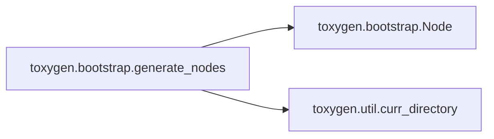

### Object Calls

* toxygen.bootstrap.Node
* toxygen.util.curr_directory

<!---Documatic-block-toxygen.bootstrap.generate_nodes-start--->
<details>
	<summary><code>toxygen.bootstrap.generate_nodes</code> code snippet</summary>

```python
def generate_nodes():
    with open(curr_directory() + '/nodes.json', 'rt') as fl:
        json_nodes = json.loads(fl.read())['nodes']
    nodes = map(lambda json_node: Node(json_node), json_nodes)
    sorted_nodes = sorted(nodes, key=lambda x: x.priority)[-4:]
    for node in sorted_nodes:
        yield node.get_data()
```
</details>
<!---Documatic-block-toxygen.bootstrap.generate_nodes-end--->
<!---Documatic-section-generate_nodes-end--->

# #
<!---Documatic-section-toxygen.bootstrap.generate_nodes-end--->

<!---Documatic-section-toxygen.util.append_slash-start--->
## toxygen.util.append_slash

<!---Documatic-section-append_slash-start--->
<!---Documatic-block-toxygen.util.append_slash-start--->
<details>
	<summary><code>toxygen.util.append_slash</code> code snippet</summary>

```python
def append_slash(s):
    if len(s) and s[-1] not in ('\\', '/'):
        s += '/'
    return s
```
</details>
<!---Documatic-block-toxygen.util.append_slash-end--->
<!---Documatic-section-append_slash-end--->

# #
<!---Documatic-section-toxygen.util.append_slash-end--->

<!---Documatic-section-toxygen.util.copy-start--->
## toxygen.util.copy

<!---Documatic-section-copy-start--->
<!---Documatic-block-toxygen.util.copy-start--->
<details>
	<summary><code>toxygen.util.copy</code> code snippet</summary>

```python
def copy(src, dest):
    if not os.path.exists(dest):
        os.makedirs(dest)
    src_files = os.listdir(src)
    for file_name in src_files:
        full_file_name = os.path.join(src, file_name)
        if os.path.isfile(full_file_name):
            shutil.copy(full_file_name, dest)
        else:
            copy(full_file_name, os.path.join(dest, file_name))
```
</details>
<!---Documatic-block-toxygen.util.copy-end--->
<!---Documatic-section-copy-end--->

# #
<!---Documatic-section-toxygen.util.copy-end--->

<!---Documatic-section-toxygen.callbacks.friend_message-start--->
## toxygen.callbacks.friend_message

<!---Documatic-section-friend_message-start--->
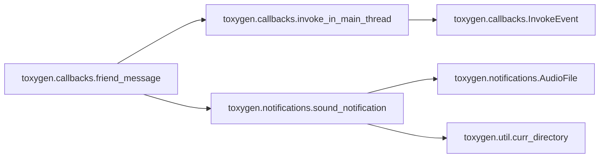

### Object Calls

* toxygen.callbacks.invoke_in_main_thread
* toxygen.notifications.sound_notification

<!---Documatic-block-toxygen.callbacks.friend_message-start--->
<details>
	<summary><code>toxygen.callbacks.friend_message</code> code snippet</summary>

```python
def friend_message(window, tray):

    def wrapped(tox, friend_number, message_type, message, size, user_data):
        profile = Profile.get_instance()
        settings = Settings.get_instance()
        message = str(message, 'utf-8')
        invoke_in_main_thread(profile.new_message, friend_number, message_type, message)
        if not window.isActiveWindow():
            friend = profile.get_friend_by_number(friend_number)
            if settings['notifications'] and profile.status != TOX_USER_STATUS['BUSY'] and (not settings.locked):
                invoke_in_main_thread(tray_notification, friend.name, message, tray, window)
            if settings['sound_notifications'] and profile.status != TOX_USER_STATUS['BUSY']:
                sound_notification(SOUND_NOTIFICATION['MESSAGE'])
            invoke_in_main_thread(tray.setIcon, QtGui.QIcon(curr_directory() + '/images/icon_new_messages.png'))
    return wrapped
```
</details>
<!---Documatic-block-toxygen.callbacks.friend_message-end--->
<!---Documatic-section-friend_message-end--->

# #
<!---Documatic-section-toxygen.callbacks.friend_message-end--->

<!---Documatic-section-toxygen.notifications.sound_notification-start--->
## toxygen.notifications.sound_notification

<!---Documatic-section-sound_notification-start--->
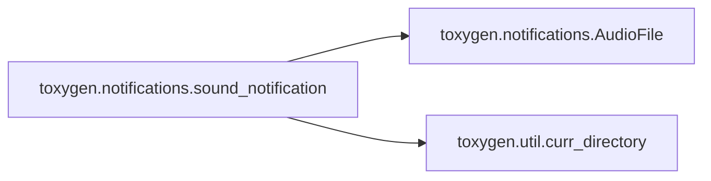

### Object Calls

* toxygen.notifications.AudioFile
* toxygen.util.curr_directory

<!---Documatic-block-toxygen.notifications.sound_notification-start--->
<details>
	<summary><code>toxygen.notifications.sound_notification</code> code snippet</summary>

```python
def sound_notification(t):
    if t == SOUND_NOTIFICATION['MESSAGE']:
        f = curr_directory() + '/sounds/message.wav'
    elif t == SOUND_NOTIFICATION['FILE_TRANSFER']:
        f = curr_directory() + '/sounds/file.wav'
    else:
        f = curr_directory() + '/sounds/contact.wav'
    a = AudioFile(f)
    a.play()
    a.close()
```
</details>
<!---Documatic-block-toxygen.notifications.sound_notification-end--->
<!---Documatic-section-sound_notification-end--->

# #
<!---Documatic-section-toxygen.notifications.sound_notification-end--->

<!---Documatic-section-toxygen.bootstrap.download_nodes_list-start--->
## toxygen.bootstrap.download_nodes_list

<!---Documatic-section-download_nodes_list-start--->
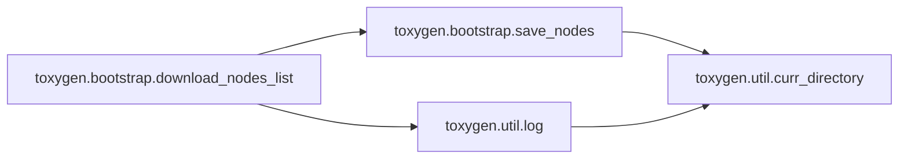

### Object Calls

* toxygen.bootstrap.save_nodes
* toxygen.util.log

<!---Documatic-block-toxygen.bootstrap.download_nodes_list-start--->
<details>
	<summary><code>toxygen.bootstrap.download_nodes_list</code> code snippet</summary>

```python
def download_nodes_list():
    url = 'https://nodes.tox.chat/json'
    s = settings.Settings.get_instance()
    if not s['download_nodes_list']:
        return
    if not s['proxy_type']:
        try:
            req = urllib.request.Request(url)
            req.add_header('Content-Type', 'application/json')
            response = urllib.request.urlopen(req)
            result = response.read()
            save_nodes(result)
        except Exception as ex:
            log('TOX nodes loading error: ' + str(ex))
    else:
        netman = QtNetwork.QNetworkAccessManager()
        proxy = QtNetwork.QNetworkProxy()
        proxy.setType(QtNetwork.QNetworkProxy.Socks5Proxy if s['proxy_type'] == 2 else QtNetwork.QNetworkProxy.HttpProxy)
        proxy.setHostName(s['proxy_host'])
        proxy.setPort(s['proxy_port'])
        netman.setProxy(proxy)
        try:
            request = QtNetwork.QNetworkRequest()
            request.setUrl(QtCore.QUrl(url))
            reply = netman.get(request)
            while not reply.isFinished():
                QtCore.QThread.msleep(1)
                QtCore.QCoreApplication.processEvents()
            data = bytes(reply.readAll().data())
            save_nodes(data)
        except Exception as ex:
            log('TOX nodes loading error: ' + str(ex))
```
</details>
<!---Documatic-block-toxygen.bootstrap.download_nodes_list-end--->
<!---Documatic-section-download_nodes_list-end--->

# #
<!---Documatic-section-toxygen.bootstrap.download_nodes_list-end--->

<!---Documatic-section-toxygen.util.time_offset-start--->
## toxygen.util.time_offset

<!---Documatic-section-time_offset-start--->
<!---Documatic-block-toxygen.util.time_offset-start--->
<details>
	<summary><code>toxygen.util.time_offset</code> code snippet</summary>

```python
@cached
def time_offset():
    hours = int(time.strftime('%H'))
    minutes = int(time.strftime('%M'))
    sec = int(time.time()) - time.timezone
    (m, s) = divmod(sec, 60)
    (h, m) = divmod(m, 60)
    (d, h) = divmod(h, 24)
    result = hours * 60 + minutes - h * 60 - m
    return result
```
</details>
<!---Documatic-block-toxygen.util.time_offset-end--->
<!---Documatic-section-time_offset-end--->

# #
<!---Documatic-section-toxygen.util.time_offset-end--->

<!---Documatic-section-toxygen.callbacks.self_connection_status-start--->
## toxygen.callbacks.self_connection_status

<!---Documatic-section-self_connection_status-start--->
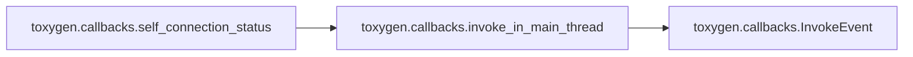

### Object Calls

* toxygen.callbacks.invoke_in_main_thread

<!---Documatic-block-toxygen.callbacks.self_connection_status-start--->
<details>
	<summary><code>toxygen.callbacks.self_connection_status</code> code snippet</summary>

```python
def self_connection_status(tox_link):

    def wrapped(tox, connection, user_data):
        print('Connection status: ', str(connection))
        profile = Profile.get_instance()
        if profile.status is None:
            status = tox_link.self_get_status()
            invoke_in_main_thread(profile.set_status, status)
        elif connection == TOX_CONNECTION['NONE']:
            invoke_in_main_thread(profile.set_status, None)
    return wrapped
```
</details>
<!---Documatic-block-toxygen.callbacks.self_connection_status-end--->
<!---Documatic-section-self_connection_status-end--->

# #
<!---Documatic-section-toxygen.callbacks.self_connection_status-end--->

<!---Documatic-section-toxygen.tox.bin_to_string-start--->
## toxygen.tox.bin_to_string

<!---Documatic-section-bin_to_string-start--->
<!---Documatic-block-toxygen.tox.bin_to_string-start--->
<details>
	<summary><code>toxygen.tox.bin_to_string</code> code snippet</summary>

```python
def bin_to_string(raw_id, length):
    res = ''.join(('{:02x}'.format(ord(raw_id[i])) for i in range(length)))
    return res.upper()
```
</details>
<!---Documatic-block-toxygen.tox.bin_to_string-end--->
<!---Documatic-section-bin_to_string-end--->

# #
<!---Documatic-section-toxygen.tox.bin_to_string-end--->

<!---Documatic-section-toxygen.notifications.AudioFile-start--->
## toxygen.notifications.AudioFile

<!---Documatic-section-AudioFile-start--->
<!---Documatic-block-toxygen.notifications.AudioFile-start--->
<details>
	<summary><code>toxygen.notifications.AudioFile</code> code snippet</summary>

```python
class AudioFile:
    chunk = 1024

    def __init__(self, fl):
        self.wf = wave.open(fl, 'rb')
        self.p = pyaudio.PyAudio()
        self.stream = self.p.open(format=self.p.get_format_from_width(self.wf.getsampwidth()), channels=self.wf.getnchannels(), rate=self.wf.getframerate(), output=True)

    def play(self):
        data = self.wf.readframes(self.chunk)
        while data:
            self.stream.write(data)
            data = self.wf.readframes(self.chunk)

    def close(self):
        self.stream.close()
        self.p.terminate()
```
</details>
<!---Documatic-block-toxygen.notifications.AudioFile-end--->
<!---Documatic-section-AudioFile-end--->

# #
<!---Documatic-section-toxygen.notifications.AudioFile-end--->

<!---Documatic-section-toxygen.util.curr_time-start--->
## toxygen.util.curr_time

<!---Documatic-section-curr_time-start--->
<!---Documatic-block-toxygen.util.curr_time-start--->
<details>
	<summary><code>toxygen.util.curr_time</code> code snippet</summary>

```python
def curr_time():
    return time.strftime('%H:%M')
```
</details>
<!---Documatic-block-toxygen.util.curr_time-end--->
<!---Documatic-section-curr_time-end--->

# #
<!---Documatic-section-toxygen.util.curr_time-end--->

<!---Documatic-section-toxygen.callbacks.tox_file_recv-start--->
## toxygen.callbacks.tox_file_recv

<!---Documatic-section-tox_file_recv-start--->
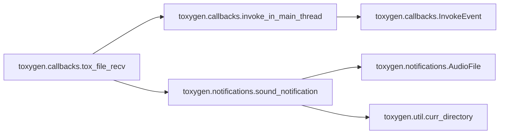

### Object Calls

* toxygen.callbacks.invoke_in_main_thread
* toxygen.notifications.sound_notification

<!---Documatic-block-toxygen.callbacks.tox_file_recv-start--->
<details>
	<summary><code>toxygen.callbacks.tox_file_recv</code> code snippet</summary>

```python
def tox_file_recv(window, tray):

    def wrapped(tox, friend_number, file_number, file_type, size, file_name, file_name_size, user_data):
        profile = Profile.get_instance()
        settings = Settings.get_instance()
        if file_type == TOX_FILE_KIND['DATA']:
            print('File')
            try:
                file_name = str(file_name[:file_name_size], 'utf-8')
            except:
                file_name = 'toxygen_file'
            invoke_in_main_thread(profile.incoming_file_transfer, friend_number, file_number, size, file_name)
            if not window.isActiveWindow():
                friend = profile.get_friend_by_number(friend_number)
                if settings['notifications'] and profile.status != TOX_USER_STATUS['BUSY'] and (not settings.locked):
                    file_from = QtWidgets.QApplication.translate('Callback', 'File from')
                    invoke_in_main_thread(tray_notification, file_from + ' ' + friend.name, file_name, tray, window)
                if settings['sound_notifications'] and profile.status != TOX_USER_STATUS['BUSY']:
                    sound_notification(SOUND_NOTIFICATION['FILE_TRANSFER'])
                invoke_in_main_thread(tray.setIcon, QtGui.QIcon(curr_directory() + '/images/icon_new_messages.png'))
        else:
            print('Avatar')
            invoke_in_main_thread(profile.incoming_avatar, friend_number, file_number, size)
    return wrapped
```
</details>
<!---Documatic-block-toxygen.callbacks.tox_file_recv-end--->
<!---Documatic-section-tox_file_recv-end--->

# #
<!---Documatic-section-toxygen.callbacks.tox_file_recv-end--->

<!---Documatic-section-toxygen.bootstrap.save_nodes-start--->
## toxygen.bootstrap.save_nodes

<!---Documatic-section-save_nodes-start--->
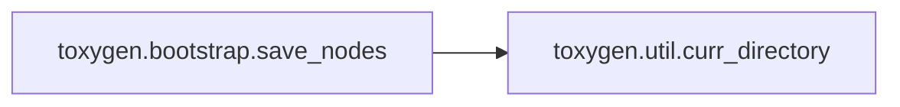

### Object Calls

* toxygen.util.curr_directory

<!---Documatic-block-toxygen.bootstrap.save_nodes-start--->
<details>
	<summary><code>toxygen.bootstrap.save_nodes</code> code snippet</summary>

```python
def save_nodes(nodes):
    if not nodes:
        return
    print('Saving nodes...')
    with open(curr_directory() + '/nodes.json', 'wb') as fl:
        fl.write(nodes)
```
</details>
<!---Documatic-block-toxygen.bootstrap.save_nodes-end--->
<!---Documatic-section-save_nodes-end--->

# #
<!---Documatic-section-toxygen.bootstrap.save_nodes-end--->

<!---Documatic-section-toxygen.callbacks.init_callbacks-start--->
## toxygen.callbacks.init_callbacks

<!---Documatic-section-init_callbacks-start--->
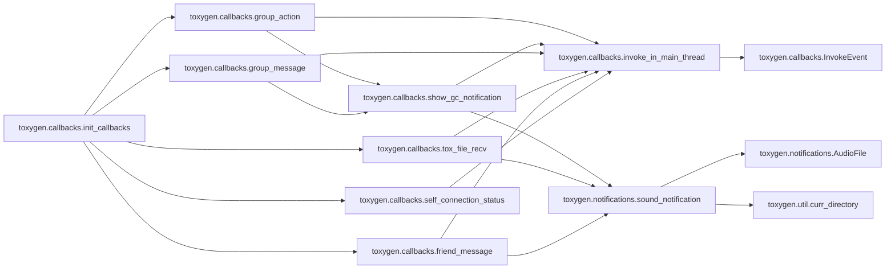

### Object Calls

* toxygen.callbacks.self_connection_status
* toxygen.callbacks.friend_message
* toxygen.callbacks.tox_file_recv
* toxygen.callbacks.group_message
* toxygen.callbacks.group_action

<!---Documatic-block-toxygen.callbacks.init_callbacks-start--->
<details>
	<summary><code>toxygen.callbacks.init_callbacks</code> code snippet</summary>

```python
def init_callbacks(tox, window, tray):
    tox.callback_self_connection_status(self_connection_status(tox), 0)
    tox.callback_friend_status(friend_status, 0)
    tox.callback_friend_message(friend_message(window, tray), 0)
    tox.callback_friend_connection_status(friend_connection_status, 0)
    tox.callback_friend_name(friend_name, 0)
    tox.callback_friend_status_message(friend_status_message, 0)
    tox.callback_friend_request(friend_request, 0)
    tox.callback_friend_typing(friend_typing, 0)
    tox.callback_friend_read_receipt(friend_read_receipt, 0)
    tox.callback_file_recv(tox_file_recv(window, tray), 0)
    tox.callback_file_recv_chunk(file_recv_chunk, 0)
    tox.callback_file_chunk_request(file_chunk_request, 0)
    tox.callback_file_recv_control(file_recv_control, 0)
    toxav = tox.AV
    toxav.callback_call_state(call_state, 0)
    toxav.callback_call(call, 0)
    toxav.callback_audio_receive_frame(callback_audio, 0)
    toxav.callback_video_receive_frame(video_receive_frame, 0)
    tox.callback_friend_lossless_packet(lossless_packet, 0)
    tox.callback_friend_lossy_packet(lossy_packet, 0)
    tox.callback_group_invite(group_invite)
    tox.callback_group_message(group_message(window, tray))
    tox.callback_group_action(group_action(window, tray))
    tox.callback_group_title(group_title)
    tox.callback_group_namelist_change(group_namelist_change)
```
</details>
<!---Documatic-block-toxygen.callbacks.init_callbacks-end--->
<!---Documatic-section-init_callbacks-end--->

# #
<!---Documatic-section-toxygen.callbacks.init_callbacks-end--->

<!---Documatic-section-toxygen.callbacks.stop-start--->
## toxygen.callbacks.stop

<!---Documatic-section-stop-start--->
<!---Documatic-block-toxygen.callbacks.stop-start--->
<details>
	<summary><code>toxygen.callbacks.stop</code> code snippet</summary>

```python
def stop():
    _thread.stop()
    _thread.join()
```
</details>
<!---Documatic-block-toxygen.callbacks.stop-end--->
<!---Documatic-section-stop-end--->

# #
<!---Documatic-section-toxygen.callbacks.stop-end--->

<!---Documatic-section-toxygen.file_transfers.is_inline-start--->
## toxygen.file_transfers.is_inline

<!---Documatic-section-is_inline-start--->
<!---Documatic-block-toxygen.file_transfers.is_inline-start--->
<details>
	<summary><code>toxygen.file_transfers.is_inline</code> code snippet</summary>

```python
def is_inline(file_name):
    return file_name in ALLOWED_FILES or file_name.startswith('qTox_Screenshot_') or file_name.startswith('qTox_Image_')
```
</details>
<!---Documatic-block-toxygen.file_transfers.is_inline-end--->
<!---Documatic-section-is_inline-end--->

# #
<!---Documatic-section-toxygen.file_transfers.is_inline-end--->

<!---Documatic-section-toxygen.util.convert_time-start--->
## toxygen.util.convert_time

<!---Documatic-section-convert_time-start--->
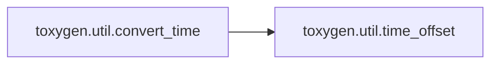

### Object Calls

* toxygen.util.time_offset

<!---Documatic-block-toxygen.util.convert_time-start--->
<details>
	<summary><code>toxygen.util.convert_time</code> code snippet</summary>

```python
def convert_time(t):
    offset = time.timezone + time_offset() * 60
    sec = int(t) - offset
    (m, s) = divmod(sec, 60)
    (h, m) = divmod(m, 60)
    (d, h) = divmod(h, 24)
    return '%02d:%02d' % (h, m)
```
</details>
<!---Documatic-block-toxygen.util.convert_time-end--->
<!---Documatic-section-convert_time-end--->

# #
<!---Documatic-section-toxygen.util.convert_time-end--->

<!---Documatic-section-toxygen.tox_dns.send_request-start--->
## toxygen.tox_dns.send_request

<!---Documatic-section-send_request-start--->
<!---Documatic-block-toxygen.tox_dns.send_request-start--->
<details>
	<summary><code>toxygen.tox_dns.send_request</code> code snippet</summary>

```python
def send_request(url, data):
    req = urllib.request.Request(url)
    req.add_header('Content-Type', 'application/json')
    response = urllib.request.urlopen(req, bytes(json.dumps(data), 'utf-8'))
    res = json.loads(str(response.read(), 'utf-8'))
    if not res['c']:
        return res['tox_id']
    else:
        raise LookupError()
```
</details>
<!---Documatic-block-toxygen.tox_dns.send_request-end--->
<!---Documatic-section-send_request-end--->

# #
<!---Documatic-section-toxygen.tox_dns.send_request-end--->

<!---Documatic-section-toxygen.util.remove-start--->
## toxygen.util.remove

<!---Documatic-section-remove-start--->
<!---Documatic-block-toxygen.util.remove-start--->
<details>
	<summary><code>toxygen.util.remove</code> code snippet</summary>

```python
def remove(folder):
    if os.path.isdir(folder):
        shutil.rmtree(folder)
```
</details>
<!---Documatic-block-toxygen.util.remove-end--->
<!---Documatic-section-remove-end--->

# #
<!---Documatic-section-toxygen.util.remove-end--->

<!---Documatic-section-toxygen.notifications.tray_notification-start--->
## toxygen.notifications.tray_notification

<!---Documatic-section-tray_notification-start--->
<!---Documatic-block-toxygen.notifications.tray_notification-start--->
<details>
	<summary><code>toxygen.notifications.tray_notification</code> code snippet</summary>

```python
def tray_notification(title, text, tray, window):
    if QtWidgets.QSystemTrayIcon.isSystemTrayAvailable():
        if len(text) > 30:
            text = text[:27] + '...'
        tray.showMessage(title, text, QtWidgets.QSystemTrayIcon.NoIcon, 3000)
        QtWidgets.QApplication.alert(window, 0)

        def message_clicked():
            window.setWindowState(window.windowState() & ~QtCore.Qt.WindowMinimized | QtCore.Qt.WindowActive)
            window.activateWindow()
        tray.messageClicked.connect(message_clicked)
```
</details>
<!---Documatic-block-toxygen.notifications.tray_notification-end--->
<!---Documatic-section-tray_notification-end--->

# #
<!---Documatic-section-toxygen.notifications.tray_notification-end--->

<!---Documatic-section-toxygen.util.log-start--->
## toxygen.util.log

<!---Documatic-section-log-start--->
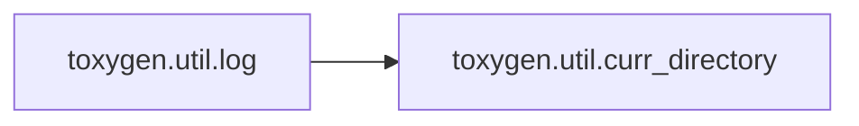

### Object Calls

* toxygen.util.curr_directory

<!---Documatic-block-toxygen.util.log-start--->
<details>
	<summary><code>toxygen.util.log</code> code snippet</summary>

```python
def log(data):
    try:
        with open(curr_directory() + '/logs.log', 'a') as fl:
            fl.write(str(data) + '\n')
    except:
        pass
```
</details>
<!---Documatic-block-toxygen.util.log-end--->
<!---Documatic-section-log-end--->

# #
<!---Documatic-section-toxygen.util.log-end--->

<!---Documatic-section-toxygen.callbacks.group_action-start--->
## toxygen.callbacks.group_action

<!---Documatic-section-group_action-start--->
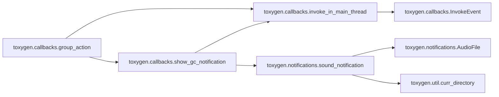

### Object Calls

* toxygen.callbacks.invoke_in_main_thread
* toxygen.callbacks.show_gc_notification

<!---Documatic-block-toxygen.callbacks.group_action-start--->
<details>
	<summary><code>toxygen.callbacks.group_action</code> code snippet</summary>

```python
def group_action(window, tray):

    def wrapped(tox, group_number, peer_number, message, length, user_data):
        message = str(message[:length], 'utf-8')
        invoke_in_main_thread(Profile.get_instance().new_gc_message, group_number, peer_number, TOX_MESSAGE_TYPE['ACTION'], message)
        show_gc_notification(window, tray, message, group_number, peer_number)
    return wrapped
```
</details>
<!---Documatic-block-toxygen.callbacks.group_action-end--->
<!---Documatic-section-group_action-end--->

# #
<!---Documatic-section-toxygen.callbacks.group_action-end--->

[_Documentation generated by Documatic_](https://www.documatic.com)