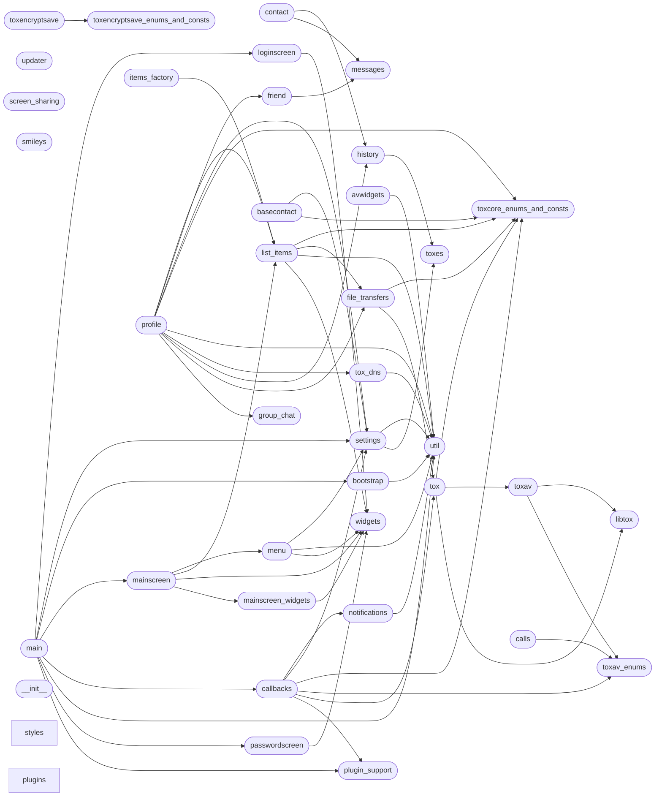

# Code Overview

[_Documentation generated by Documatic_](https://www.documatic.com)

<!---Documatic-section-Codebase Structure Python-start--->
## Codebase Structure Python

The codebase has a single-depth folder structure,
                with 42 code files in total.

<!---Documatic-block-system_architecture-start--->

<!---Documatic-block-system_architecture-end--->

# #
<!---Documatic-section-Codebase Structure Python-end--->

<!---Documatic-section-Important Functions-start--->
## Important Functions

<!---Documatic-block-important_funcs-start--->
<!---Documatic-block-most_used_funcs-start--->
### Most Utilised Functions

* [toxygen.util.curr_directory](9-toxygen_util.md#toxygen.util.curr_directory) (8 times)
* [toxygen.util.log](9-toxygen_util.md#toxygen.util.log) (4 times)
* [toxygen.widgets.create_menu](10-toxygen_widgets.md#toxygen.widgets.create_menu) (3 times)
* [toxygen.util.copy](9-toxygen_util.md#toxygen.util.copy) (2 times)
* [toxygen.notifications.sound_notification](4-toxygen_notifications.md#toxygen.notifications.sound_notification) (1 times)
* [toxygen.notifications.tray_notification](4-toxygen_notifications.md#toxygen.notifications.tray_notification) (1 times)
* [toxygen.tox.bin_to_string](8-toxygen_tox.md#toxygen.tox.bin_to_string) (1 times)
* [toxygen.bootstrap.generate_nodes](7-toxygen_bootstrap.md#toxygen.bootstrap.generate_nodes) (1 times)
* [toxygen.bootstrap.download_nodes_list](7-toxygen_bootstrap.md#toxygen.bootstrap.download_nodes_list) (1 times)
* [toxygen.callbacks.init_callbacks](5-toxygen_callbacks.md#toxygen.callbacks.init_callbacks) (1 times)
* [toxygen.callbacks.stop](5-toxygen_callbacks.md#toxygen.callbacks.stop) (1 times)
* [toxygen.callbacks.start](5-toxygen_callbacks.md#toxygen.callbacks.start) (1 times)
* toxygen.util.program_version (1 times)
* [toxygen.util.remove](9-toxygen_util.md#toxygen.util.remove) (1 times)
* [toxygen.util.convert_time](9-toxygen_util.md#toxygen.util.convert_time) (1 times)
* [toxygen.util.curr_time](9-toxygen_util.md#toxygen.util.curr_time) (1 times)
* [toxygen.util.append_slash](9-toxygen_util.md#toxygen.util.append_slash) (1 times)
* [toxygen.tox_dns.tox_dns](8-toxygen_tox.md#toxygen.tox_dns.tox_dns) (1 times)
* toxygen.file_transfers.is_inline (1 times)
<!---Documatic-block-most_used_funcs-end--->
<!---Documatic-block-important_funcs-end--->

# #
<!---Documatic-section-Important Functions-end--->

<!---Documatic-section-File IO-start--->
## File IO

<!---Documatic-block-file_io-start--->
The following files have file read operations

<!---Documatic-block-toxygen-start--->

	
<code>toxygen</code> (Click to Expand!)

* toxygen.avwidgets
* toxygen.bootstrap
* toxygen.file_transfers
* toxygen.history
* toxygen.main
* toxygen.mainscreen_widgets
* toxygen.menu
* toxygen.notifications
* toxygen.profile
* toxygen.settings
* toxygen.smileys

<!---Documatic-block-toxygen-end--->

<!---Documatic-block-toxygen.plugins-start--->

	
<code>toxygen.plugins</code> (Click to Expand!)

* toxygen.plugins.plugin_super_class

<!---Documatic-block-toxygen.plugins-end--->

The following files have file write operations

<!---Documatic-block-toxygen-start--->

	
<code>toxygen</code> (Click to Expand!)

* toxygen.basecontact
* toxygen.bootstrap
* toxygen.file_transfers
* toxygen.history
* toxygen.mainscreen
* toxygen.settings
* toxygen.util

<!---Documatic-block-toxygen-end--->

<!---Documatic-block-toxygen.plugins-start--->

	
<code>toxygen.plugins</code> (Click to Expand!)

* toxygen.plugins.plugin_super_class

<!---Documatic-block-toxygen.plugins-end--->
<!---Documatic-block-file_io-end--->

# #
<!---Documatic-section-File IO-end--->

<!---Documatic-section-Class Hierarchy-start--->
## Class Hierarchy

<!---Documatic-block-contact.Contact-start--->

	
<code>contact.Contact</code> (Click to Expand!)

* toxygen.friend.Friend
* toxygen.group_chat.GroupChat

<!---Documatic-block-contact.Contact-end--->

<!---Documatic-block-toxygen.basecontact.BaseContact-start--->

	
<code>toxygen.basecontact.BaseContact</code> (Click to Expand!)

* toxygen.contact.Contact
* toxygen.profile.Profile

<!---Documatic-block-toxygen.basecontact.BaseContact-end--->

<!---Documatic-block-toxygen.contact.Contact-start--->

	
<code>toxygen.contact.Contact</code> (Click to Expand!)

* toxygen.friend.Friend
* toxygen.group_chat.GroupChat

<!---Documatic-block-toxygen.contact.Contact-end--->

<!---Documatic-block-toxygen.file_transfers.FileTransfer-start--->

	
<code>toxygen.file_transfers.FileTransfer</code> (Click to Expand!)

* toxygen.file_transfers.ReceiveTransfer
* toxygen.file_transfers.SendTransfer

<!---Documatic-block-toxygen.file_transfers.FileTransfer-end--->

<!---Documatic-block-toxygen.file_transfers.SendTransfer-start--->

	
<code>toxygen.file_transfers.SendTransfer</code> (Click to Expand!)

* toxygen.file_transfers.SendAvatar
* toxygen.file_transfers.SendFromFileBuffer

<!---Documatic-block-toxygen.file_transfers.SendTransfer-end--->

<!---Documatic-block-toxygen.passwordscreen.PasswordScreenBase-start--->

	
<code>toxygen.passwordscreen.PasswordScreenBase</code> (Click to Expand!)

* toxygen.passwordscreen.PasswordScreen
* toxygen.passwordscreen.UnlockAppScreen

<!---Documatic-block-toxygen.passwordscreen.PasswordScreenBase-end--->

<!---Documatic-block-toxygen.widgets.CenteredWidget-start--->

	
<code>toxygen.widgets.CenteredWidget</code> (Click to Expand!)

* toxygen.avwidgets.IncomingCallWidget
* toxygen.passwordscreen.PasswordScreenBase

<!---Documatic-block-toxygen.widgets.CenteredWidget-end--->

# #
<!---Documatic-section-Class Hierarchy-end--->

[_Documentation generated by Documatic_](https://www.documatic.com)