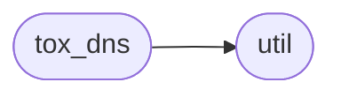
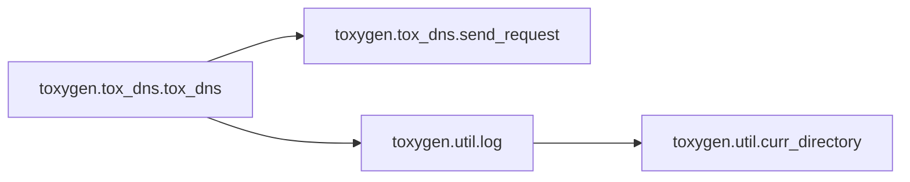

# Toxygen Tox Dns

[_Documentation generated by Documatic_](https://www.documatic.com)

<!---Documatic-section-Codebase Structure-start--->
## Codebase Structure

<!---Documatic-block-system_architecture-start--->

<!---Documatic-block-system_architecture-end--->

# #
<!---Documatic-section-Codebase Structure-end--->

<!---Documatic-section-toxygen.tox_dns.tox_dns-start--->
## [toxygen.tox_dns.tox_dns](8-toxygen_tox.md#toxygen.tox_dns.tox_dns)

<!---Documatic-section-tox_dns-start--->


### Object Calls

* [toxygen.tox_dns.send_request](8-toxygen_tox.md#toxygen.tox_dns.send_request)
* [toxygen.util.log](9-toxygen_util.md#toxygen.util.log)

<!---Documatic-block-toxygen.tox_dns.tox_dns-start--->
<details>
	<summary><code>toxygen.tox_dns.tox_dns</code> code snippet</summary>

```python
def tox_dns(email):
    site = email.split('@')[1]
    data = {'action': 3, 'name': '{}'.format(email)}
    urls = ('https://{}/api'.format(site), 'http://{}/api'.format(site))
    s = settings.Settings.get_instance()
    if not s['proxy_type']:
        for url in urls:
            try:
                return send_request(url, data)
            except Exception as ex:
                log('TOX DNS ERROR: ' + str(ex))
    else:
        netman = QtNetwork.QNetworkAccessManager()
        proxy = QtNetwork.QNetworkProxy()
        proxy.setType(QtNetwork.QNetworkProxy.Socks5Proxy if s['proxy_type'] == 2 else QtNetwork.QNetworkProxy.HttpProxy)
        proxy.setHostName(s['proxy_host'])
        proxy.setPort(s['proxy_port'])
        netman.setProxy(proxy)
        for url in urls:
            try:
                request = QtNetwork.QNetworkRequest()
                request.setUrl(QtCore.QUrl(url))
                request.setHeader(QtNetwork.QNetworkRequest.ContentTypeHeader, 'application/json')
                reply = netman.post(request, bytes(json.dumps(data), 'utf-8'))
                while not reply.isFinished():
                    QtCore.QThread.msleep(1)
                    QtCore.QCoreApplication.processEvents()
                data = bytes(reply.readAll().data())
                result = json.loads(str(data, 'utf-8'))
                if not result['c']:
                    return result['tox_id']
            except Exception as ex:
                log('TOX DNS ERROR: ' + str(ex))
    return None
```
</details>
<!---Documatic-block-toxygen.tox_dns.tox_dns-end--->
<!---Documatic-section-tox_dns-end--->

# #
<!---Documatic-section-toxygen.tox_dns.tox_dns-end--->

<!---Documatic-section-toxygen.tox_dns.send_request-start--->
## [toxygen.tox_dns.send_request](8-toxygen_tox.md#toxygen.tox_dns.send_request)

<!---Documatic-section-send_request-start--->
<!---Documatic-block-toxygen.tox_dns.send_request-start--->
<details>
	<summary><code>toxygen.tox_dns.send_request</code> code snippet</summary>

```python
def send_request(url, data):
    req = urllib.request.Request(url)
    req.add_header('Content-Type', 'application/json')
    response = urllib.request.urlopen(req, bytes(json.dumps(data), 'utf-8'))
    res = json.loads(str(response.read(), 'utf-8'))
    if not res['c']:
        return res['tox_id']
    else:
        raise LookupError()
```
</details>
<!---Documatic-block-toxygen.tox_dns.send_request-end--->
<!---Documatic-section-send_request-end--->

# #
<!---Documatic-section-toxygen.tox_dns.send_request-end--->

[_Documentation generated by Documatic_](https://www.documatic.com)