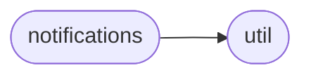
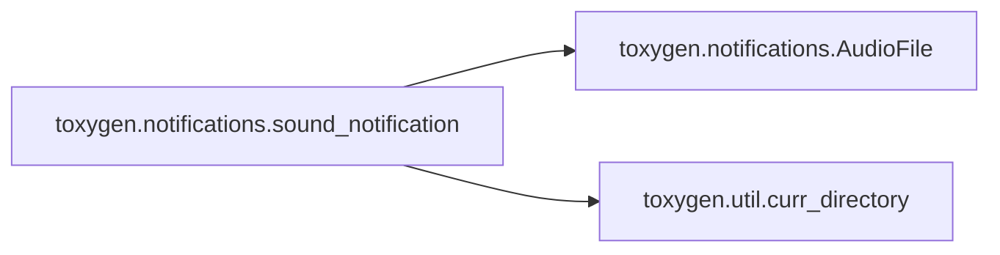

# Toxygen Notifications

[_Documentation generated by Documatic_](https://www.documatic.com)

<!---Documatic-section-Codebase Structure-start--->
## Codebase Structure

<!---Documatic-block-system_architecture-start--->

<!---Documatic-block-system_architecture-end--->

# #
<!---Documatic-section-Codebase Structure-end--->

<!---Documatic-section-toxygen.notifications.sound_notification-start--->
## [toxygen.notifications.sound_notification](4-toxygen_notifications.md#toxygen.notifications.sound_notification)

<!---Documatic-section-sound_notification-start--->


### Object Calls

* [toxygen.notifications.AudioFile](4-toxygen_notifications.md#toxygen.notifications.AudioFile)
* [toxygen.util.curr_directory](9-toxygen_util.md#toxygen.util.curr_directory)

<!---Documatic-block-toxygen.notifications.sound_notification-start--->
<details>
	<summary><code>toxygen.notifications.sound_notification</code> code snippet</summary>

```python
def sound_notification(t):
    if t == SOUND_NOTIFICATION['MESSAGE']:
        f = curr_directory() + '/sounds/message.wav'
    elif t == SOUND_NOTIFICATION['FILE_TRANSFER']:
        f = curr_directory() + '/sounds/file.wav'
    else:
        f = curr_directory() + '/sounds/contact.wav'
    a = AudioFile(f)
    a.play()
    a.close()
```
</details>
<!---Documatic-block-toxygen.notifications.sound_notification-end--->
<!---Documatic-section-sound_notification-end--->

# #
<!---Documatic-section-toxygen.notifications.sound_notification-end--->

<!---Documatic-section-toxygen.notifications.tray_notification-start--->
## [toxygen.notifications.tray_notification](4-toxygen_notifications.md#toxygen.notifications.tray_notification)

<!---Documatic-section-tray_notification-start--->
<!---Documatic-block-toxygen.notifications.tray_notification-start--->
<details>
	<summary><code>toxygen.notifications.tray_notification</code> code snippet</summary>

```python
def tray_notification(title, text, tray, window):
    if QtWidgets.QSystemTrayIcon.isSystemTrayAvailable():
        if len(text) > 30:
            text = text[:27] + '...'
        tray.showMessage(title, text, QtWidgets.QSystemTrayIcon.NoIcon, 3000)
        QtWidgets.QApplication.alert(window, 0)

        def message_clicked():
            window.setWindowState(window.windowState() & ~QtCore.Qt.WindowMinimized | QtCore.Qt.WindowActive)
            window.activateWindow()
        tray.messageClicked.connect(message_clicked)
```
</details>
<!---Documatic-block-toxygen.notifications.tray_notification-end--->
<!---Documatic-section-tray_notification-end--->

# #
<!---Documatic-section-toxygen.notifications.tray_notification-end--->

<!---Documatic-section-toxygen.notifications.AudioFile-start--->
## [toxygen.notifications.AudioFile](4-toxygen_notifications.md#toxygen.notifications.AudioFile)

<!---Documatic-section-AudioFile-start--->
<!---Documatic-block-toxygen.notifications.AudioFile-start--->
<details>
	<summary><code>toxygen.notifications.AudioFile</code> code snippet</summary>

```python
class AudioFile:
    chunk = 1024

    def __init__(self, fl):
        self.wf = wave.open(fl, 'rb')
        self.p = pyaudio.PyAudio()
        self.stream = self.p.open(format=self.p.get_format_from_width(self.wf.getsampwidth()), channels=self.wf.getnchannels(), rate=self.wf.getframerate(), output=True)

    def play(self):
        data = self.wf.readframes(self.chunk)
        while data:
            self.stream.write(data)
            data = self.wf.readframes(self.chunk)

    def close(self):
        self.stream.close()
        self.p.terminate()
```
</details>
<!---Documatic-block-toxygen.notifications.AudioFile-end--->
<!---Documatic-section-AudioFile-end--->

# #
<!---Documatic-section-toxygen.notifications.AudioFile-end--->

[_Documentation generated by Documatic_](https://www.documatic.com)