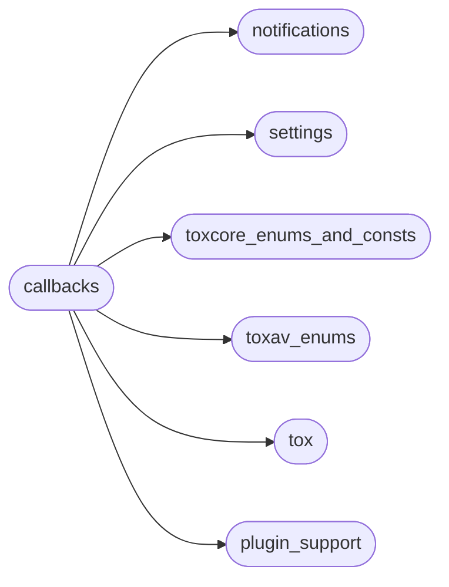
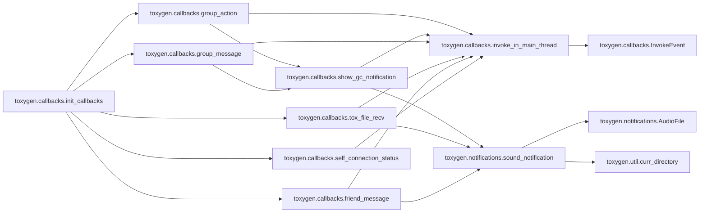
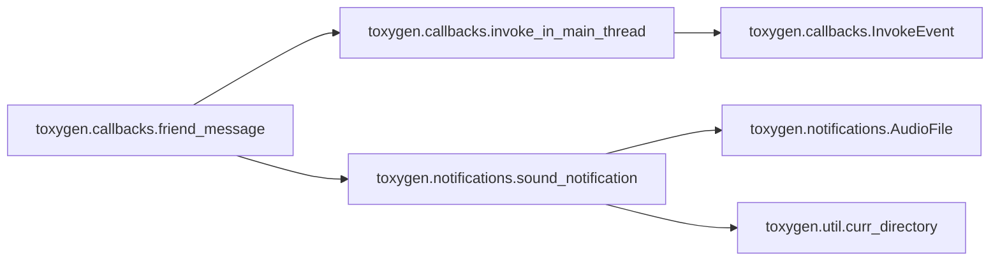
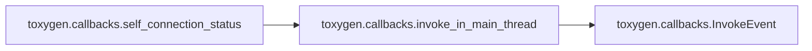
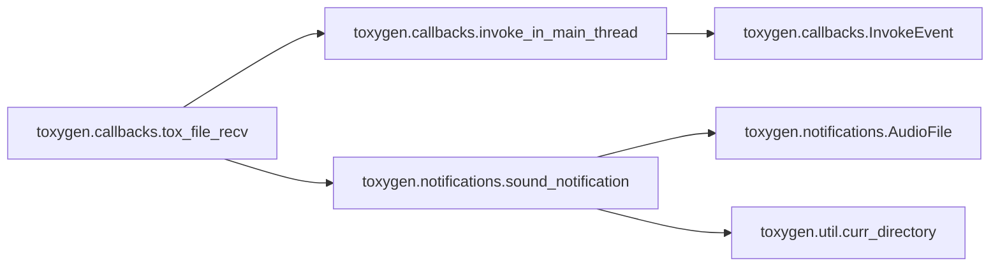
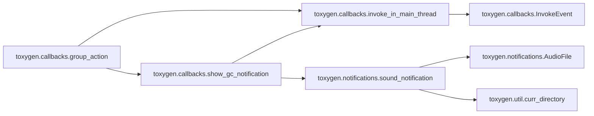

# Toxygen Callbacks

[_Documentation generated by Documatic_](https://www.documatic.com)

<!---Documatic-section-Codebase Structure-start--->
## Codebase Structure

<!---Documatic-block-system_architecture-start--->

<!---Documatic-block-system_architecture-end--->

# #
<!---Documatic-section-Codebase Structure-end--->

<!---Documatic-section-toxygen.callbacks.init_callbacks-start--->
## [toxygen.callbacks.init_callbacks](5-toxygen_callbacks.md#toxygen.callbacks.init_callbacks)

<!---Documatic-section-init_callbacks-start--->


### Object Calls

* [toxygen.callbacks.self_connection_status](5-toxygen_callbacks.md#toxygen.callbacks.self_connection_status)
* [toxygen.callbacks.friend_message](5-toxygen_callbacks.md#toxygen.callbacks.friend_message)
* [toxygen.callbacks.tox_file_recv](5-toxygen_callbacks.md#toxygen.callbacks.tox_file_recv)
* [toxygen.callbacks.group_message](5-toxygen_callbacks.md#toxygen.callbacks.group_message)
* [toxygen.callbacks.group_action](5-toxygen_callbacks.md#toxygen.callbacks.group_action)

<!---Documatic-block-toxygen.callbacks.init_callbacks-start--->
<details>
	<summary><code>toxygen.callbacks.init_callbacks</code> code snippet</summary>

```python
def init_callbacks(tox, window, tray):
    tox.callback_self_connection_status(self_connection_status(tox), 0)
    tox.callback_friend_status(friend_status, 0)
    tox.callback_friend_message(friend_message(window, tray), 0)
    tox.callback_friend_connection_status(friend_connection_status, 0)
    tox.callback_friend_name(friend_name, 0)
    tox.callback_friend_status_message(friend_status_message, 0)
    tox.callback_friend_request(friend_request, 0)
    tox.callback_friend_typing(friend_typing, 0)
    tox.callback_friend_read_receipt(friend_read_receipt, 0)
    tox.callback_file_recv(tox_file_recv(window, tray), 0)
    tox.callback_file_recv_chunk(file_recv_chunk, 0)
    tox.callback_file_chunk_request(file_chunk_request, 0)
    tox.callback_file_recv_control(file_recv_control, 0)
    toxav = tox.AV
    toxav.callback_call_state(call_state, 0)
    toxav.callback_call(call, 0)
    toxav.callback_audio_receive_frame(callback_audio, 0)
    toxav.callback_video_receive_frame(video_receive_frame, 0)
    tox.callback_friend_lossless_packet(lossless_packet, 0)
    tox.callback_friend_lossy_packet(lossy_packet, 0)
    tox.callback_group_invite(group_invite)
    tox.callback_group_message(group_message(window, tray))
    tox.callback_group_action(group_action(window, tray))
    tox.callback_group_title(group_title)
    tox.callback_group_namelist_change(group_namelist_change)
```
</details>
<!---Documatic-block-toxygen.callbacks.init_callbacks-end--->
<!---Documatic-section-init_callbacks-end--->

# #
<!---Documatic-section-toxygen.callbacks.init_callbacks-end--->

<!---Documatic-section-toxygen.callbacks.stop-start--->
## [toxygen.callbacks.stop](5-toxygen_callbacks.md#toxygen.callbacks.stop)

<!---Documatic-section-stop-start--->
<!---Documatic-block-toxygen.callbacks.stop-start--->
<details>
	<summary><code>toxygen.callbacks.stop</code> code snippet</summary>

```python
def stop():
    _thread.stop()
    _thread.join()
```
</details>
<!---Documatic-block-toxygen.callbacks.stop-end--->
<!---Documatic-section-stop-end--->

# #
<!---Documatic-section-toxygen.callbacks.stop-end--->

<!---Documatic-section-toxygen.callbacks.start-start--->
## [toxygen.callbacks.start](5-toxygen_callbacks.md#toxygen.callbacks.start)

<!---Documatic-section-start-start--->
<!---Documatic-block-toxygen.callbacks.start-start--->
<details>
	<summary><code>toxygen.callbacks.start</code> code snippet</summary>

```python
def start():
    _thread.start()
```
</details>
<!---Documatic-block-toxygen.callbacks.start-end--->
<!---Documatic-section-start-end--->

# #
<!---Documatic-section-toxygen.callbacks.start-end--->

<!---Documatic-section-toxygen.callbacks.group_message-start--->
## [toxygen.callbacks.group_message](5-toxygen_callbacks.md#toxygen.callbacks.group_message)

<!---Documatic-section-group_message-start--->


### Object Calls

* toxygen.callbacks.invoke_in_main_thread
* toxygen.callbacks.show_gc_notification

<!---Documatic-block-toxygen.callbacks.group_message-start--->
<details>
	<summary><code>toxygen.callbacks.group_message</code> code snippet</summary>

```python
def group_message(window, tray):

    def wrapped(tox, group_number, peer_number, message, length, user_data):
        message = str(message[:length], 'utf-8')
        invoke_in_main_thread(Profile.get_instance().new_gc_message, group_number, peer_number, TOX_MESSAGE_TYPE['NORMAL'], message)
        show_gc_notification(window, tray, message, group_number, peer_number)
    return wrapped
```
</details>
<!---Documatic-block-toxygen.callbacks.group_message-end--->
<!---Documatic-section-group_message-end--->

# #
<!---Documatic-section-toxygen.callbacks.group_message-end--->

<!---Documatic-section-toxygen.callbacks.friend_message-start--->
## [toxygen.callbacks.friend_message](5-toxygen_callbacks.md#toxygen.callbacks.friend_message)

<!---Documatic-section-friend_message-start--->


### Object Calls

* toxygen.callbacks.invoke_in_main_thread
* [toxygen.notifications.sound_notification](4-toxygen_notifications.md#toxygen.notifications.sound_notification)

<!---Documatic-block-toxygen.callbacks.friend_message-start--->
<details>
	<summary><code>toxygen.callbacks.friend_message</code> code snippet</summary>

```python
def friend_message(window, tray):

    def wrapped(tox, friend_number, message_type, message, size, user_data):
        profile = Profile.get_instance()
        settings = Settings.get_instance()
        message = str(message, 'utf-8')
        invoke_in_main_thread(profile.new_message, friend_number, message_type, message)
        if not window.isActiveWindow():
            friend = profile.get_friend_by_number(friend_number)
            if settings['notifications'] and profile.status != TOX_USER_STATUS['BUSY'] and (not settings.locked):
                invoke_in_main_thread(tray_notification, friend.name, message, tray, window)
            if settings['sound_notifications'] and profile.status != TOX_USER_STATUS['BUSY']:
                sound_notification(SOUND_NOTIFICATION['MESSAGE'])
            invoke_in_main_thread(tray.setIcon, QtGui.QIcon(curr_directory() + '/images/icon_new_messages.png'))
    return wrapped
```
</details>
<!---Documatic-block-toxygen.callbacks.friend_message-end--->
<!---Documatic-section-friend_message-end--->

# #
<!---Documatic-section-toxygen.callbacks.friend_message-end--->

<!---Documatic-section-toxygen.callbacks.self_connection_status-start--->
## [toxygen.callbacks.self_connection_status](5-toxygen_callbacks.md#toxygen.callbacks.self_connection_status)

<!---Documatic-section-self_connection_status-start--->


### Object Calls

* toxygen.callbacks.invoke_in_main_thread

<!---Documatic-block-toxygen.callbacks.self_connection_status-start--->
<details>
	<summary><code>toxygen.callbacks.self_connection_status</code> code snippet</summary>

```python
def self_connection_status(tox_link):

    def wrapped(tox, connection, user_data):
        print('Connection status: ', str(connection))
        profile = Profile.get_instance()
        if profile.status is None:
            status = tox_link.self_get_status()
            invoke_in_main_thread(profile.set_status, status)
        elif connection == TOX_CONNECTION['NONE']:
            invoke_in_main_thread(profile.set_status, None)
    return wrapped
```
</details>
<!---Documatic-block-toxygen.callbacks.self_connection_status-end--->
<!---Documatic-section-self_connection_status-end--->

# #
<!---Documatic-section-toxygen.callbacks.self_connection_status-end--->

<!---Documatic-section-toxygen.callbacks.tox_file_recv-start--->
## [toxygen.callbacks.tox_file_recv](5-toxygen_callbacks.md#toxygen.callbacks.tox_file_recv)

<!---Documatic-section-tox_file_recv-start--->


### Object Calls

* toxygen.callbacks.invoke_in_main_thread
* [toxygen.notifications.sound_notification](4-toxygen_notifications.md#toxygen.notifications.sound_notification)

<!---Documatic-block-toxygen.callbacks.tox_file_recv-start--->
<details>
	<summary><code>toxygen.callbacks.tox_file_recv</code> code snippet</summary>

```python
def tox_file_recv(window, tray):

    def wrapped(tox, friend_number, file_number, file_type, size, file_name, file_name_size, user_data):
        profile = Profile.get_instance()
        settings = Settings.get_instance()
        if file_type == TOX_FILE_KIND['DATA']:
            print('File')
            try:
                file_name = str(file_name[:file_name_size], 'utf-8')
            except:
                file_name = 'toxygen_file'
            invoke_in_main_thread(profile.incoming_file_transfer, friend_number, file_number, size, file_name)
            if not window.isActiveWindow():
                friend = profile.get_friend_by_number(friend_number)
                if settings['notifications'] and profile.status != TOX_USER_STATUS['BUSY'] and (not settings.locked):
                    file_from = QtWidgets.QApplication.translate('Callback', 'File from')
                    invoke_in_main_thread(tray_notification, file_from + ' ' + friend.name, file_name, tray, window)
                if settings['sound_notifications'] and profile.status != TOX_USER_STATUS['BUSY']:
                    sound_notification(SOUND_NOTIFICATION['FILE_TRANSFER'])
                invoke_in_main_thread(tray.setIcon, QtGui.QIcon(curr_directory() + '/images/icon_new_messages.png'))
        else:
            print('Avatar')
            invoke_in_main_thread(profile.incoming_avatar, friend_number, file_number, size)
    return wrapped
```
</details>
<!---Documatic-block-toxygen.callbacks.tox_file_recv-end--->
<!---Documatic-section-tox_file_recv-end--->

# #
<!---Documatic-section-toxygen.callbacks.tox_file_recv-end--->

<!---Documatic-section-toxygen.callbacks.group_action-start--->
## [toxygen.callbacks.group_action](5-toxygen_callbacks.md#toxygen.callbacks.group_action)

<!---Documatic-section-group_action-start--->


### Object Calls

* toxygen.callbacks.invoke_in_main_thread
* toxygen.callbacks.show_gc_notification

<!---Documatic-block-toxygen.callbacks.group_action-start--->
<details>
	<summary><code>toxygen.callbacks.group_action</code> code snippet</summary>

```python
def group_action(window, tray):

    def wrapped(tox, group_number, peer_number, message, length, user_data):
        message = str(message[:length], 'utf-8')
        invoke_in_main_thread(Profile.get_instance().new_gc_message, group_number, peer_number, TOX_MESSAGE_TYPE['ACTION'], message)
        show_gc_notification(window, tray, message, group_number, peer_number)
    return wrapped
```
</details>
<!---Documatic-block-toxygen.callbacks.group_action-end--->
<!---Documatic-section-group_action-end--->

# #
<!---Documatic-section-toxygen.callbacks.group_action-end--->

[_Documentation generated by Documatic_](https://www.documatic.com)