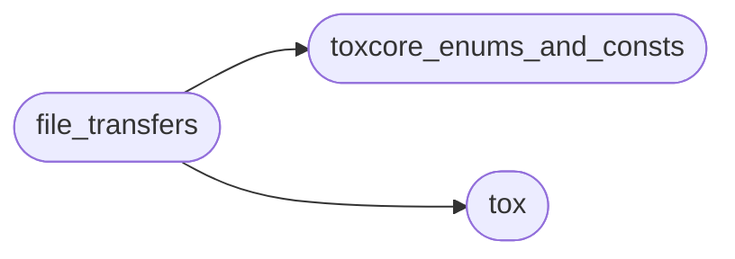

# Toxygen File Transfers

[_Documentation generated by Documatic_](https://www.documatic.com)

<!---Documatic-section-Codebase Structure-start--->
## Codebase Structure

<!---Documatic-block-system_architecture-start--->

<!---Documatic-block-system_architecture-end--->

# #
<!---Documatic-section-Codebase Structure-end--->

<!---Documatic-section-toxygen.file_transfers.is_inline-start--->
## toxygen.file_transfers.is_inline

<!---Documatic-section-is_inline-start--->
<!---Documatic-block-toxygen.file_transfers.is_inline-start--->
<details>
	<summary><code>toxygen.file_transfers.is_inline</code> code snippet</summary>

```python
def is_inline(file_name):
    return file_name in ALLOWED_FILES or file_name.startswith('qTox_Screenshot_') or file_name.startswith('qTox_Image_')
```
</details>
<!---Documatic-block-toxygen.file_transfers.is_inline-end--->
<!---Documatic-section-is_inline-end--->

# #
<!---Documatic-section-toxygen.file_transfers.is_inline-end--->

[_Documentation generated by Documatic_](https://www.documatic.com)