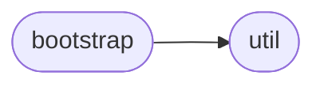
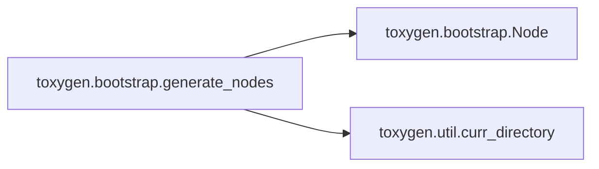
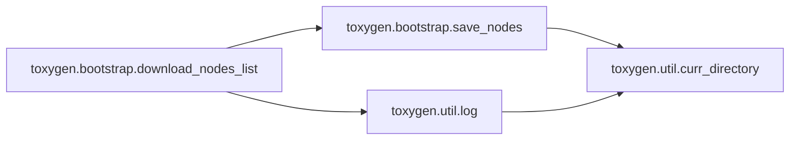
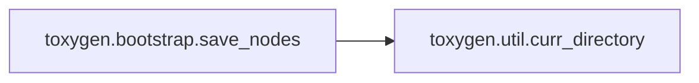

# Toxygen Bootstrap

[_Documentation generated by Documatic_](https://www.documatic.com)

<!---Documatic-section-Codebase Structure-start--->
## Codebase Structure

<!---Documatic-block-system_architecture-start--->

<!---Documatic-block-system_architecture-end--->

# #
<!---Documatic-section-Codebase Structure-end--->

<!---Documatic-section-toxygen.bootstrap.generate_nodes-start--->
## [toxygen.bootstrap.generate_nodes](7-toxygen_bootstrap.md#toxygen.bootstrap.generate_nodes)

<!---Documatic-section-generate_nodes-start--->


### Object Calls

* [toxygen.bootstrap.Node](7-toxygen_bootstrap.md#toxygen.bootstrap.Node)
* [toxygen.util.curr_directory](9-toxygen_util.md#toxygen.util.curr_directory)

<!---Documatic-block-toxygen.bootstrap.generate_nodes-start--->
<details>
	<summary><code>toxygen.bootstrap.generate_nodes</code> code snippet</summary>

```python
def generate_nodes():
    with open(curr_directory() + '/nodes.json', 'rt') as fl:
        json_nodes = json.loads(fl.read())['nodes']
    nodes = map(lambda json_node: Node(json_node), json_nodes)
    sorted_nodes = sorted(nodes, key=lambda x: x.priority)[-4:]
    for node in sorted_nodes:
        yield node.get_data()
```
</details>
<!---Documatic-block-toxygen.bootstrap.generate_nodes-end--->
<!---Documatic-section-generate_nodes-end--->

# #
<!---Documatic-section-toxygen.bootstrap.generate_nodes-end--->

<!---Documatic-section-toxygen.bootstrap.download_nodes_list-start--->
## [toxygen.bootstrap.download_nodes_list](7-toxygen_bootstrap.md#toxygen.bootstrap.download_nodes_list)

<!---Documatic-section-download_nodes_list-start--->


### Object Calls

* [toxygen.bootstrap.save_nodes](7-toxygen_bootstrap.md#toxygen.bootstrap.save_nodes)
* [toxygen.util.log](9-toxygen_util.md#toxygen.util.log)

<!---Documatic-block-toxygen.bootstrap.download_nodes_list-start--->
<details>
	<summary><code>toxygen.bootstrap.download_nodes_list</code> code snippet</summary>

```python
def download_nodes_list():
    url = 'https://nodes.tox.chat/json'
    s = settings.Settings.get_instance()
    if not s['download_nodes_list']:
        return
    if not s['proxy_type']:
        try:
            req = urllib.request.Request(url)
            req.add_header('Content-Type', 'application/json')
            response = urllib.request.urlopen(req)
            result = response.read()
            save_nodes(result)
        except Exception as ex:
            log('TOX nodes loading error: ' + str(ex))
    else:
        netman = QtNetwork.QNetworkAccessManager()
        proxy = QtNetwork.QNetworkProxy()
        proxy.setType(QtNetwork.QNetworkProxy.Socks5Proxy if s['proxy_type'] == 2 else QtNetwork.QNetworkProxy.HttpProxy)
        proxy.setHostName(s['proxy_host'])
        proxy.setPort(s['proxy_port'])
        netman.setProxy(proxy)
        try:
            request = QtNetwork.QNetworkRequest()
            request.setUrl(QtCore.QUrl(url))
            reply = netman.get(request)
            while not reply.isFinished():
                QtCore.QThread.msleep(1)
                QtCore.QCoreApplication.processEvents()
            data = bytes(reply.readAll().data())
            save_nodes(data)
        except Exception as ex:
            log('TOX nodes loading error: ' + str(ex))
```
</details>
<!---Documatic-block-toxygen.bootstrap.download_nodes_list-end--->
<!---Documatic-section-download_nodes_list-end--->

# #
<!---Documatic-section-toxygen.bootstrap.download_nodes_list-end--->

<!---Documatic-section-toxygen.bootstrap.Node-start--->
## [toxygen.bootstrap.Node](7-toxygen_bootstrap.md#toxygen.bootstrap.Node)

<!---Documatic-section-Node-start--->
<!---Documatic-block-toxygen.bootstrap.Node-start--->
<details>
	<summary><code>toxygen.bootstrap.Node</code> code snippet</summary>

```python
class Node:

    def __init__(self, node):
        (self._ip, self._port, self._tox_key) = (node['ipv4'], node['port'], node['public_key'])
        self._priority = random.randint(1, 1000000) if node['status_tcp'] and node['status_udp'] else 0

    def get_priority(self):
        return self._priority
    priority = property(get_priority)

    def get_data(self):
        return (bytes(self._ip, 'utf-8'), self._port, self._tox_key)
```
</details>
<!---Documatic-block-toxygen.bootstrap.Node-end--->
<!---Documatic-section-Node-end--->

# #
<!---Documatic-section-toxygen.bootstrap.Node-end--->

<!---Documatic-section-toxygen.bootstrap.save_nodes-start--->
## [toxygen.bootstrap.save_nodes](7-toxygen_bootstrap.md#toxygen.bootstrap.save_nodes)

<!---Documatic-section-save_nodes-start--->


### Object Calls

* [toxygen.util.curr_directory](9-toxygen_util.md#toxygen.util.curr_directory)

<!---Documatic-block-toxygen.bootstrap.save_nodes-start--->
<details>
	<summary><code>toxygen.bootstrap.save_nodes</code> code snippet</summary>

```python
def save_nodes(nodes):
    if not nodes:
        return
    print('Saving nodes...')
    with open(curr_directory() + '/nodes.json', 'wb') as fl:
        fl.write(nodes)
```
</details>
<!---Documatic-block-toxygen.bootstrap.save_nodes-end--->
<!---Documatic-section-save_nodes-end--->

# #
<!---Documatic-section-toxygen.bootstrap.save_nodes-end--->

[_Documentation generated by Documatic_](https://www.documatic.com)