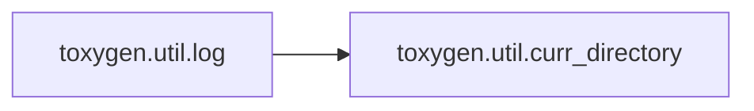
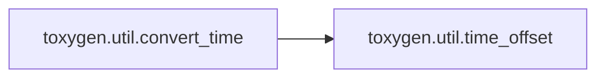

# Toxygen Util

[_Documentation generated by Documatic_](https://www.documatic.com)

<!---Documatic-section-Codebase Structure-start--->
## Codebase Structure

<!---Documatic-block-system_architecture-start--->
```mermaid
None
```
<!---Documatic-block-system_architecture-end--->

# #
<!---Documatic-section-Codebase Structure-end--->

<!---Documatic-section-toxygen.util.curr_directory-start--->
## [toxygen.util.curr_directory](9-toxygen_util.md#toxygen.util.curr_directory)

<!---Documatic-section-curr_directory-start--->
<!---Documatic-block-toxygen.util.curr_directory-start--->
<details>
	<summary><code>toxygen.util.curr_directory</code> code snippet</summary>

```python
@cached
def curr_directory():
    return os.path.dirname(os.path.realpath(__file__))
```
</details>
<!---Documatic-block-toxygen.util.curr_directory-end--->
<!---Documatic-section-curr_directory-end--->

# #
<!---Documatic-section-toxygen.util.curr_directory-end--->

<!---Documatic-section-toxygen.util.log-start--->
## [toxygen.util.log](9-toxygen_util.md#toxygen.util.log)

<!---Documatic-section-log-start--->


### Object Calls

* [toxygen.util.curr_directory](9-toxygen_util.md#toxygen.util.curr_directory)

<!---Documatic-block-toxygen.util.log-start--->
<details>
	<summary><code>toxygen.util.log</code> code snippet</summary>

```python
def log(data):
    try:
        with open(curr_directory() + '/logs.log', 'a') as fl:
            fl.write(str(data) + '\n')
    except:
        pass
```
</details>
<!---Documatic-block-toxygen.util.log-end--->
<!---Documatic-section-log-end--->

# #
<!---Documatic-section-toxygen.util.log-end--->

<!---Documatic-section-toxygen.util.copy-start--->
## [toxygen.util.copy](9-toxygen_util.md#toxygen.util.copy)

<!---Documatic-section-copy-start--->
<!---Documatic-block-toxygen.util.copy-start--->
<details>
	<summary><code>toxygen.util.copy</code> code snippet</summary>

```python
def copy(src, dest):
    if not os.path.exists(dest):
        os.makedirs(dest)
    src_files = os.listdir(src)
    for file_name in src_files:
        full_file_name = os.path.join(src, file_name)
        if os.path.isfile(full_file_name):
            shutil.copy(full_file_name, dest)
        else:
            copy(full_file_name, os.path.join(dest, file_name))
```
</details>
<!---Documatic-block-toxygen.util.copy-end--->
<!---Documatic-section-copy-end--->

# #
<!---Documatic-section-toxygen.util.copy-end--->

<!---Documatic-section-toxygen.util.remove-start--->
## [toxygen.util.remove](9-toxygen_util.md#toxygen.util.remove)

<!---Documatic-section-remove-start--->
<!---Documatic-block-toxygen.util.remove-start--->
<details>
	<summary><code>toxygen.util.remove</code> code snippet</summary>

```python
def remove(folder):
    if os.path.isdir(folder):
        shutil.rmtree(folder)
```
</details>
<!---Documatic-block-toxygen.util.remove-end--->
<!---Documatic-section-remove-end--->

# #
<!---Documatic-section-toxygen.util.remove-end--->

<!---Documatic-section-toxygen.util.convert_time-start--->
## [toxygen.util.convert_time](9-toxygen_util.md#toxygen.util.convert_time)

<!---Documatic-section-convert_time-start--->


### Object Calls

* [toxygen.util.time_offset](9-toxygen_util.md#toxygen.util.time_offset)

<!---Documatic-block-toxygen.util.convert_time-start--->
<details>
	<summary><code>toxygen.util.convert_time</code> code snippet</summary>

```python
def convert_time(t):
    offset = time.timezone + time_offset() * 60
    sec = int(t) - offset
    (m, s) = divmod(sec, 60)
    (h, m) = divmod(m, 60)
    (d, h) = divmod(h, 24)
    return '%02d:%02d' % (h, m)
```
</details>
<!---Documatic-block-toxygen.util.convert_time-end--->
<!---Documatic-section-convert_time-end--->

# #
<!---Documatic-section-toxygen.util.convert_time-end--->

<!---Documatic-section-toxygen.util.curr_time-start--->
## [toxygen.util.curr_time](9-toxygen_util.md#toxygen.util.curr_time)

<!---Documatic-section-curr_time-start--->
<!---Documatic-block-toxygen.util.curr_time-start--->
<details>
	<summary><code>toxygen.util.curr_time</code> code snippet</summary>

```python
def curr_time():
    return time.strftime('%H:%M')
```
</details>
<!---Documatic-block-toxygen.util.curr_time-end--->
<!---Documatic-section-curr_time-end--->

# #
<!---Documatic-section-toxygen.util.curr_time-end--->

<!---Documatic-section-toxygen.util.append_slash-start--->
## [toxygen.util.append_slash](9-toxygen_util.md#toxygen.util.append_slash)

<!---Documatic-section-append_slash-start--->
<!---Documatic-block-toxygen.util.append_slash-start--->
<details>
	<summary><code>toxygen.util.append_slash</code> code snippet</summary>

```python
def append_slash(s):
    if len(s) and s[-1] not in ('\\', '/'):
        s += '/'
    return s
```
</details>
<!---Documatic-block-toxygen.util.append_slash-end--->
<!---Documatic-section-append_slash-end--->

# #
<!---Documatic-section-toxygen.util.append_slash-end--->

<!---Documatic-section-toxygen.util.time_offset-start--->
## [toxygen.util.time_offset](9-toxygen_util.md#toxygen.util.time_offset)

<!---Documatic-section-time_offset-start--->
<!---Documatic-block-toxygen.util.time_offset-start--->
<details>
	<summary><code>toxygen.util.time_offset</code> code snippet</summary>

```python
@cached
def time_offset():
    hours = int(time.strftime('%H'))
    minutes = int(time.strftime('%M'))
    sec = int(time.time()) - time.timezone
    (m, s) = divmod(sec, 60)
    (h, m) = divmod(m, 60)
    (d, h) = divmod(h, 24)
    result = hours * 60 + minutes - h * 60 - m
    return result
```
</details>
<!---Documatic-block-toxygen.util.time_offset-end--->
<!---Documatic-section-time_offset-end--->

# #
<!---Documatic-section-toxygen.util.time_offset-end--->

[_Documentation generated by Documatic_](https://www.documatic.com)